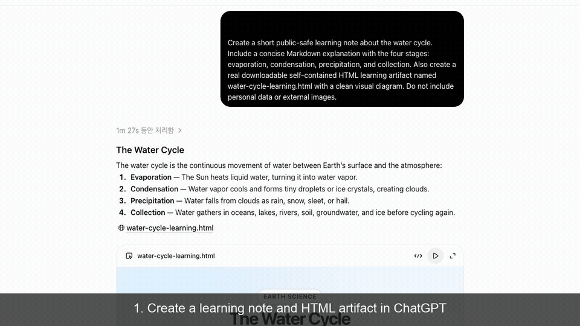

# GPT to Obsidian Saver

[English](README.md) | [한국어](README.ko.md)

GPT to Obsidian Saver는 ChatGPT 답변을 Obsidian 로컬 Markdown 노트로 저장하는 Chrome 확장 프로그램입니다. 실제 다운로드 가능한 HTML 학습자료도 노트 기준 상대 링크를 가진 첨부파일로 저장할 수 있습니다.

## 데모



이 15초 공개용 데모는 임시 ChatGPT 대화와 Obsidian 테스트 vault만 사용했습니다. 실제 HTML artifact, Save to Obsidian 실행, 생성된 Markdown 노트, 저장된 HTML 학습자료를 순서대로 보여줍니다.

공개용으로 정리한 스크린샷은 [assets/screenshots](assets/screenshots)에서도 확인할 수 있습니다. 옵션 페이지 화면은 로컬 extension ID와 vault path가 노출되지 않도록 별도로 캡처해야 하므로 아직 포함하지 않았습니다.

## 기능 요약

- ChatGPT assistant 메시지에 Save to Obsidian 버튼을 추가합니다.
- 현재 사용자 질문과 assistant 답변을 Markdown으로 저장합니다.
- 현재 ChatGPT 대화 URL을 노트 source로 기록할 수 있습니다.
- Native helper 없이 Obsidian URI mode를 사용할 수 있습니다.
- 직접 파일 저장과 HTML 첨부 저장을 위한 native-helper mode를 지원합니다.
- 실제 HTML artifact와 즉시 발생한 Chrome HTML 다운로드를 첨부파일로 저장합니다.
- 실제 HTML 첨부가 있는 노트는 HTML 학습자료 섹션을 노트 상단에 배치합니다.
- HTML 학습자료 저장 시 이전 Q&A를 사용하는 옵션을 제공합니다.
- 영어/한국어 UI를 제공합니다.

## 지원 플랫폼

| 플랫폼 | 상태 |
| --- | --- |
| Chrome on macOS | URI mode와 native-helper mode가 검증되었습니다. |
| Chrome on Windows | Obsidian URI 처리가 동작하면 URI mode는 사용할 수 있습니다. Native-helper support는 Experimental이며 이번 릴리스에서 실제 Windows 환경 검증은 하지 않았습니다. |
| Linux | 로컬 URI 처리 상태에 따라 URI mode는 동작할 수 있습니다. Native-helper mode는 지원하지 않습니다. |

## 배포 방식

현재 이 프로젝트는 GitHub Releases를 통해서만 배포되며, Chrome의 Load unpacked 기능으로 설치합니다.

Chrome Web Store에서는 제공되지 않습니다. Chrome Web Store 설치, listing, review, 자동 업데이트 동작을 기대하면 안 됩니다.

## GitHub Releases에서 설치

1. GitHub Release에서 `gpt-to-obsidian-saver-v1.5.30-unpacked-extension.zip`을 다운로드합니다.
2. `SHA256SUMS.txt`로 SHA-256 checksum을 확인합니다.
3. ZIP 파일을 압축 해제합니다.
4. `chrome://extensions`를 엽니다.
5. Developer mode를 켭니다.
6. Load unpacked를 선택합니다.
7. 압축 해제된 폴더 중 `manifest.json`이 들어 있는 폴더를 선택합니다.
8. 기존 ChatGPT 탭을 새로고침합니다.

이 방식은 unpacked GitHub 설치이므로 Chrome이 developer-mode extension 경고를 표시할 수 있습니다.

자세한 절차는 [docs/github-installation.md](docs/github-installation.md)를 참고하세요.

## Obsidian URI Mode

URI mode는 native helper가 필요 없습니다. 노트 내용을 담은 `obsidian://new` URI를 열어 Obsidian에 전달합니다.

적합한 경우:

- Markdown 노트 생성만 필요할 때
- HTML 파일을 vault 내부 첨부파일로 직접 복사할 필요가 없을 때
- 가장 단순한 설정을 원할 때

제한:

- 브라우저/운영체제의 URI 길이 제한이 큰 노트에 영향을 줄 수 있습니다.
- URI mode는 HTML 첨부파일을 vault에 직접 쓸 수 없습니다.

## Native-Helper Mode

Chrome 확장 프로그램은 임의의 로컬 파일을 직접 쓸 수 없습니다. Native-helper mode는 Chrome Native Messaging으로 로컬 helper를 호출해 설정된 Obsidian vault 안에 노트와 HTML 첨부파일을 씁니다.

필요한 경우:

- vault에 Markdown 파일을 직접 생성할 때
- HTML artifact를 첨부파일로 저장할 때
- 즉시 발생한 Chrome HTML 다운로드를 vault로 복사할 때

Native host의 allowed origin은 Chrome에 표시되는 실제 extension ID와 정확히 일치해야 합니다. Unpacked extension ID는 다른 경로나 복사본에서 로드하면 바뀔 수 있습니다. extension ID가 바뀌면 새 ID로 native-helper installer를 다시 실행하세요.

### macOS Native Helper

1. `chrome://extensions`에서 extension ID를 복사합니다.
2. `gpt-to-obsidian-saver-v1.5.30-native-host-macos.zip`을 다운로드하고 압축 해제합니다.
3. 다음을 실행합니다.

```sh
./installers/macos-install.sh --extension-id <extension-id>
```

`sudo`는 필요하지 않습니다. installer는 사용자 계정 범위의 Native Messaging host를 설치하고, 설치 시 감지한 절대 Python 경로를 사용하는 wrapper를 생성합니다.

### Windows Native Helper

Windows native-helper support는 Experimental이며 이번 릴리스에서 실제 Windows 환경 검증은 하지 않았습니다.

PowerShell:

```powershell
.\installers\windows-install.ps1 -ExtensionId <extension-id>
```

### Linux Native Helper

이번 릴리스에서는 Linux native-helper mode를 지원하지 않습니다.

## 확장 프로그램 설정

- Language: 영어 또는 한국어 UI
- Obsidian Vault name: Obsidian URI open/create 호출에 사용
- Local Obsidian vault path: native-helper 직접 저장에 필요
- Save folder path: vault 안의 상대 노트 폴더
- HTML file save folder: vault 안의 상대 첨부 폴더. 비우면 `Attachments`
- Add date prefix: 파일명에 `YYYY-MM-DD` 추가
- Also add time: 날짜 뒤에 `HH-mm-ss` 추가
- Allow question marks in file names: macOS/Linux에서 유용하지만 Windows에는 안전하지 않음
- Add title H1 to note body: 노트 본문에 보이는 H1 추가
- Save HTML code blocks as `.html` attachments: 기본값 꺼짐
- Use the previous Q&A when saving an HTML learning note: 기본값 꺼짐

## HTML 첨부파일

실제 HTML artifact에 대해 확장 프로그램은 먼저 페이지에서 읽을 수 있는 콘텐츠를 시도합니다.

- `blob:` 및 `data:` URL
- same-origin download link
- 읽을 수 있는 `a[download]` 링크
- iframe `srcdoc`
- 읽을 수 있는 iframe `blob:` source
- 접근 가능한 preview frame document

이 방식이 실패하고 사용자가 실제 HTML download candidate에서 Save to Obsidian을 클릭한 경우, `downloads` permission은 그 저장 작업 직후 다운로드된 HTML 파일을 식별하는 데만 사용됩니다. Native helper는 그 특정 `.html` 또는 `.htm` 파일만 설정된 vault 첨부 폴더로 복사합니다.

`options 2.html` 또는 `example 1.html` 같은 일반 텍스트는 첨부파일을 만들지 않습니다.

## HTML 학습자료 노트

실제 HTML 첨부가 있는 노트는 상단에 HTML 학습자료 섹션을 배치합니다.

```md
# HTML 학습자료

<native 처리 후 첨부 링크>

# 질문

...

# 답변

...
```

이전 Q&A 옵션이 켜져 있고 이전 pair를 찾은 경우:

```md
# HTML 학습자료

<native 처리 후 첨부 링크>

# 원본 질문

...

# 원본 답변

...
```

이전 pair를 찾지 못하면 현재 질문과 현재 assistant 답변으로 안전하게 fallback합니다.

## 필요한 권한

| 권한 | 이유 |
| --- | --- |
| `storage` | 언어, vault 이름, 폴더 경로, 기능 toggle 같은 설정 저장 |
| `nativeMessaging` | 로컬 native helper 호출로 vault 직접 저장 및 HTML 첨부 저장 |
| `downloads` | 사용자가 Save to Obsidian을 누른 직후 다운로드된 HTML 파일을 식별해 그 특정 파일만 Obsidian vault로 복사 |
| `https://chatgpt.com/*` | ChatGPT 메시지에 저장 버튼을 주입하고 사용자가 저장을 실행한 메시지를 읽음 |
| `https://chat.openai.com/*` | 이전 ChatGPT 도메인 지원 |

자세한 내용은 [docs/permissions.md](docs/permissions.md)를 참고하세요.

## 개인정보 요약

확장 프로그램은 사용자가 Save to Obsidian을 클릭했을 때 ChatGPT 페이지 내용을 로컬에서 처리합니다. 설정은 Chrome extension storage에 저장되고, 데이터는 Obsidian URI mode 또는 Chrome Native Messaging을 통해 로컬에 저장됩니다. 분석, telemetry, tracking, 개발자 서버, 원격 저장소, 사용자 데이터 판매 기능은 추가하지 않습니다.

현재 페이지 URL은 노트 source로 기록될 수 있습니다. Native-helper mode는 설정된 로컬 vault path를 사용해 노트와 첨부파일을 씁니다.

자세한 내용은 [docs/privacy.md](docs/privacy.md) 및 [docs/privacy.ko.md](docs/privacy.ko.md)를 참고하세요.

## 보안 모델

- Content script는 ChatGPT host permission에서만 실행됩니다.
- Background service worker가 native messaging과 즉시 HTML 다운로드 matching을 중개합니다.
- Native helper는 설정된 vault path 안에만 노트와 첨부파일을 씁니다.
- 첨부파일명과 노트 경로를 검증합니다.
- HTML 파일은 텍스트/파일 콘텐츠로 저장되며, 확장 프로그램과 native helper는 HTML을 실행하지 않습니다.
- Native host manifest는 설치된 extension ID를 정확히 허용해야 합니다.

자세한 내용은 [SECURITY.md](SECURITY.md) 및 [docs/architecture.md](docs/architecture.md)를 참고하세요.

## 알려진 제한

- Windows native-helper 설치는 실제 Windows machine에서 검증되지 않았습니다.
- Linux native-helper mode는 지원하지 않습니다.
- ChatGPT DOM 변경 시 selector 유지보수가 필요할 수 있습니다.
- Native-helper mode는 별도 설치가 필요합니다.
- GitHub 배포는 Load unpacked 설치가 필요합니다.
- 제한적이거나 sandboxed된 다운로드는 Chrome 및 ChatGPT UI 동작에 영향을 받습니다.
- Unpacked extension ID는 다른 경로에서 로드하면 바뀔 수 있습니다.

## 문제 해결

Native host 오류, extension ID mismatch, 오래된 unpacked build, HTML 첨부 실패, 첨부 링크 문제, 업데이트 절차는 [docs/troubleshooting.md](docs/troubleshooting.md)를 참고하세요.

## 기여

[CONTRIBUTING.md](CONTRIBUTING.md)를 참고하세요. 공개 issue 또는 pull request에 private ChatGPT conversation, 실제 vault path, token, credential, 민감한 log를 포함하지 마세요.

## License

MIT License. [LICENSE](LICENSE)를 참고하세요.
